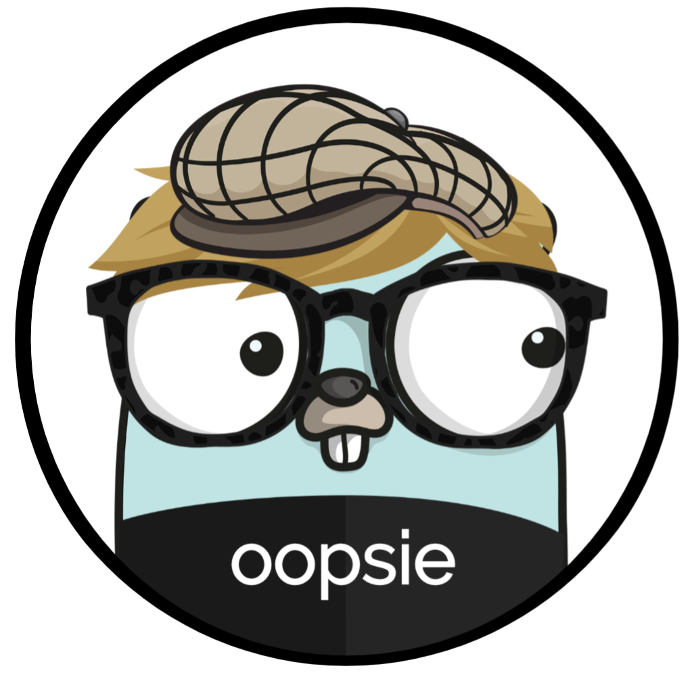
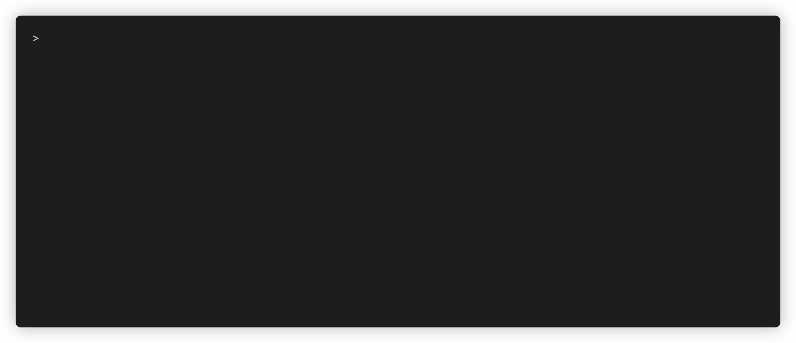
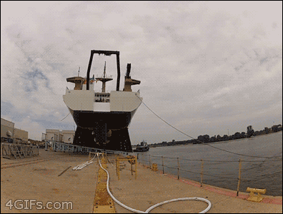

<p align="center"></p>

# oopsie
[](https://goreportcard.com/report/github.com/afritzler/oopsie)
<a href="https://gitter.im/k8s-oopsie/community"></a> <a href="https://github.com/afritzler/oopsie/actions"></a> <a href="https://github.com/afritzler/oopsie/blob/master/LICENSE"></a> <a href="https://github.com/afritzler/oopsie"></a> <a href="https://twitter.com/afritzler"></a>


Oopsie [/ˈuːpsi/] is a Kubernetes controller that watches all `Events` within a cluster and enriches failed objects with solutions found on [StackOverflow](https://stackoverflow.com) ([Github](https://github.com) and other sources coming soon).



## Why Oopsie?

Kubernetes is a great tool for orchestrating containerized workloads on a fleet of machines. Unfortunatelly, it is sometimes not that easy for new Kubernetes users to resolve problems which occur in their deployments. The illustration below is a visual representation of what happens when you deploy your first application after having mastered the [Wordpress and Guestbook examples](https://github.com/kubernetes/examples).

<p align="center"></p>

Oopsie helps you, the people on Slack or community mailing lists, save time by answering questions to problems which already have been solved.

## Usage

You can install oopsie with `GO111MODULE="on" go get github.com/afritzler/oopsie`.

__NOTE__: please use the latest go to do this, ideally go 1.13 or greater.

This will put `oopsie` in `$(go env GOPATH)/bin`. If you encounter the error `oopsie: command not found` after installation then you may need to either add that directory to your `$PATH` as shown [here](https://golang.org/doc/code.html#GOPATH) or do a manual installation by cloning the repo and run `make build` from the repository.

```shell
mkdir -p $GOPATH/src/github.com/afritzler && cd $GOPATH/src/github.com/afritzler/
git clone https://github.com/afritzler/oopsie.git
cd oopsie
make build
```

Alternatively you can build the `oopsie` binary using a Docker container

```shell
make docker-build
```

In order to use `oopsie` you will need to point `KUBECONFIG` to the path `kubeconfig` of your Kubernetes cluster.

If you have a [kind](https://github.com/kubernetes-sigs/kind) based cluster running, you can set the `KUBECONFIG` prior to running `oopsie`.

```shell
export KUBECONFIG=$(kind get kubeconfig-path)
```

For [Minikube](https://github.com/kubernetes/minikube) based setup the `kubeconfig` is typically located under `~/.kube/config`.

Now it's time to start the `oopsie` controller.

```shell
oopsie
```

Now lets brake something by creating a broken deployment on our cluster.

```shell
kubectl apply -f https://raw.githubusercontent.com/afritzler/oopsie/master/examples/nginx-broken.yaml
```

`kubectl` should give us the follwing output

```shell
NAME                                READY   STATUS         RESTARTS   AGE
nginx-deployment-6b75cdff69-f6hkg   0/1     ErrImagePull   0          10s
```

If we now look at the events of our broken pod

```shell
kubectl describe pod nginx-deployment-6b75cdff69-f6hkg
```

you should see the following output

```shell
Events:
  Type     Reason     Age   From                         Message
  ----     ------     ----  ----                         -------
  Normal   Scheduled  8s    default-scheduler            Successfully assigned default/nginx-deployment-6b75cdff69-f6hkg to kind-control-plane
  Normal   Pulling    7s    kubelet, kind-control-plane  Pulling image "afritzler/nginx:1.17.6"
  Warning  Failed     5s    kubelet, kind-control-plane  Failed to pull image "afritzler/nginx:1.17.6": rpc error: code = Unknown desc = failed to resolve image "docker.io/afritzler/nginx:1.17.6": no available registry endpoint: pull access denied, repository does not exist or may require authorization: server message: insufficient_scope: authorization failed
  Warning  Failed     5s    kubelet, kind-control-plane  Error: ErrImagePull
  Normal   BackOff    5s    kubelet, kind-control-plane  Back-off pulling image "afritzler/nginx:1.17.6"
  Warning  Failed     5s    kubelet, kind-control-plane  Error: ImagePullBackOff
  Normal   Hint       3s    StackOverflow                For error 'Error: ErrImagePull' I found something here -> https://stackoverflow.com/questions/48832017/minikube-error-errimagepull
  Normal   Hint       3s    StackOverflow                For error 'Error: ImagePullBackOff' I found something here -> https://stackoverflow.com/questions/46002478/error-imagepullbackoff-when-scaling-working-deployment-kubernetes
```

Follow now the provided SackOverflow links which hopefully help you to resolve your issue. Since `oopsie` is observing all events inside your cluster you might also want to look into the events of other objects such as `node`, `pv`, etc.

## Status and Future Work

This is the very first version of `oopsie` and currently only has one provider implemented to generate `hint` events. In the future I plan to look into the following topics:

* Github provider to provide references to Github Issues
* Use NLP techniques (tokenization/entity extraction) to improve search results
* In-cluster operations documentation

## Feedback and Support

Feedback and contributions are always welcome! Feel free to open an [issue](https://github.com/afritzler/oopsie/issues) in case you hit any road bumps.
